# Printer in bedrijf stellen

<!--Tussen stap 1 en stap 2: test of de eindstops werken-->

### Je eigen naam op de printer

Plaats een bestandje genaamd `auto0.g` met de volgende inhoud:

```gcode
M117 Harms printer
```

Alles achter M117 zal met het opstarten van de printer op het scherm verschijnen.

# Schermen

Wanneer de printer start zie je het infoscherm. 

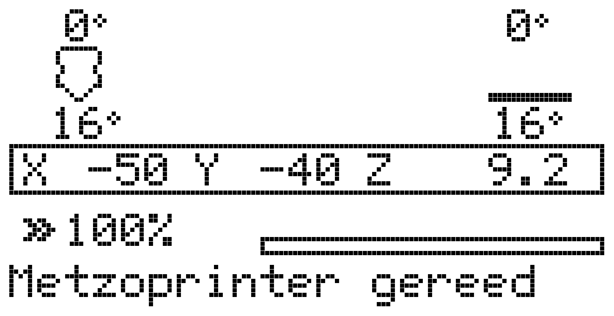

Hier lees je af:
* temperatuur van de nozzle
* temperatuur van het heated bed
* positie X-Y-Z van de nozzle.
* printsnelheid in procenten
* balkje van hoe ver de printer is met printen
* statusbericht

> [!NOTE]
> Zie je vraagtekens bij de X-Y-Z positie? Dan heeft de printer geen idee waar de printkop en het bed staan. Gebruik `Beweging` -> `Naar thuispositie` om accuraat de posities te zien

> [!NOTE]
> Knippert X, Y of Z? Dan zijn de motoren uit geweest sinds de laatste keer dat je naar de thuispositie bent geweest. Als de motor van een as uit staat kan je die as vrij bewegen. De X en Y motoren worden automatisch uitgeschakeld om energie te sparen.

> [!NOTE]
> Het draaien aan de knop zal de printsnelheid veranderen

Wanneer het bed of de nozzle verwarmd worden verandert die status:

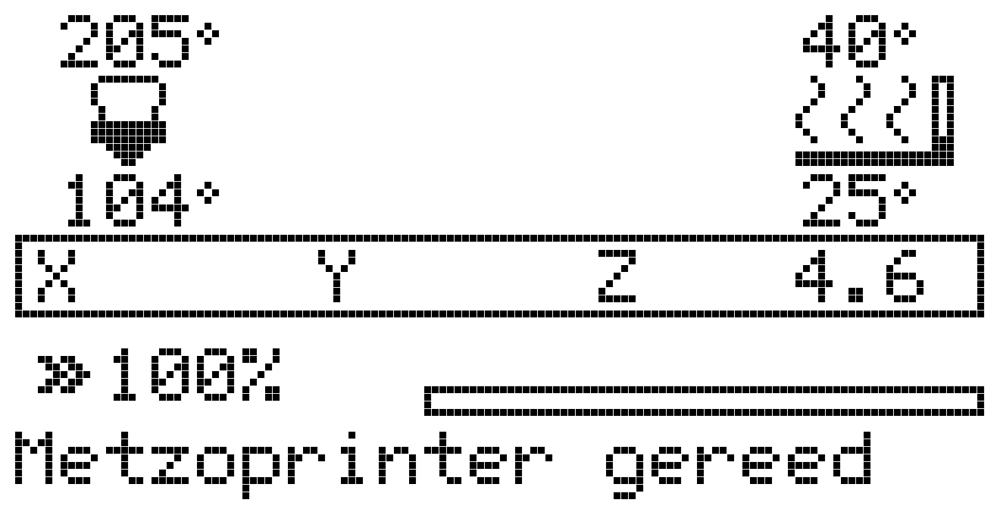

Aan de bovenkant van de icoontjes staat de gewenste temperatuur, onder het icoontje de huidige temperatuur. De nozzle loopt vol tijdens het verwarmen. Als de nozzle warm is dan zal deze gevuld zijn wanneer het verwarmingselement aan staat en leeg zijn wanneer die uit is. Bij het bed is dat te zien aan het verdwijnen/verschijnen van het balkje rechts van het bed icoontje.

## Tijdens het printen
Tijdens het printen verandert de X-Y-Z status in E-Z. E is de hoeveelheid filament die verbruikt is. Verder rouleert de printer ook tussen het percentage van de huidige print, de E (hoe lang de printer bezig is geweest met deze print), R (hoe lang het nog duurt). De geschatte tijd is in het begin nog te lang, als de printer even bezig is wordt deze betrouwbaarder.

# Het menu

Na het indrukken van de knop verschijnt het hoofdmenu. 

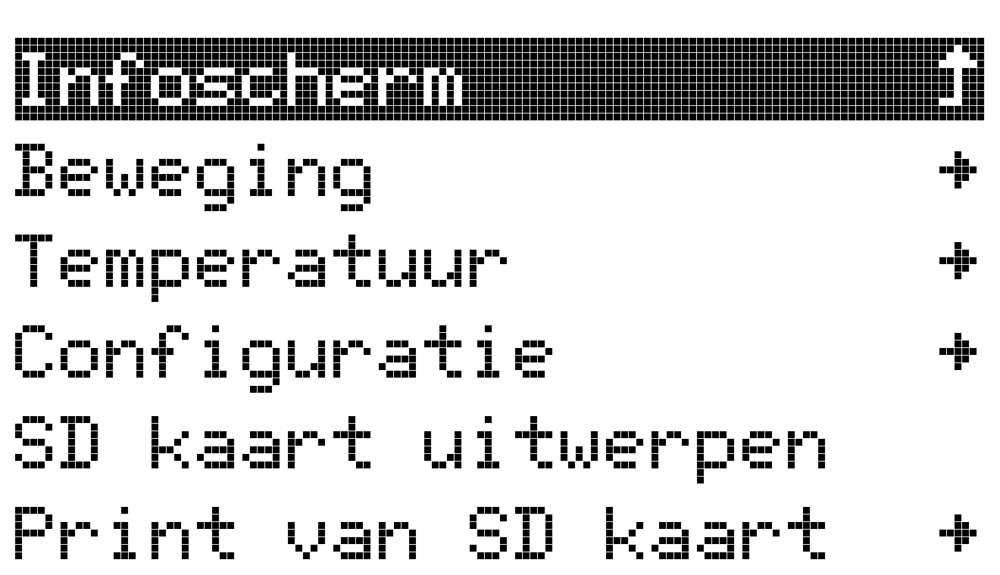

Hierin zijn de verschillende menu's beschikbaar.
* `Beweging`: printkop verplaatsen en 
* `Temperatuur`: temperatuur instellen van de printkop en het bed
* `Configuratie`: instellingen van de printer
* `SD kaart uitwerpen`: veilig verwijderen van de SD kaart
* `Print van SD kaart`: print starten

## Beweging

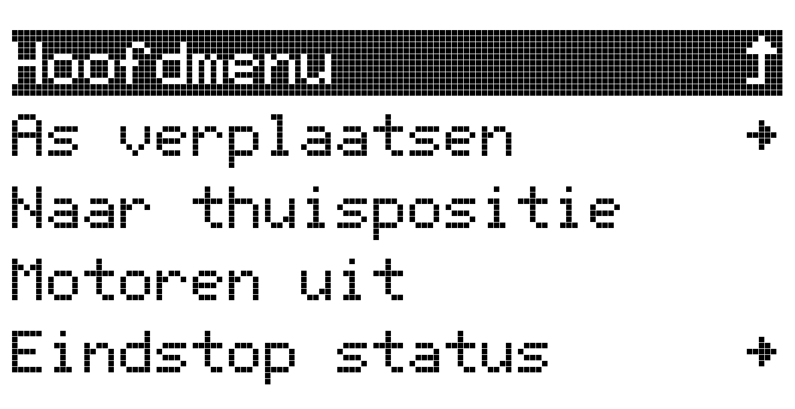

* `As verplaatsen`: verplaats de printkop en bed
* `Naar thuispositie`: de printkop beweegt in alle richtingen tweemaal naar de eindschakelaars
* `Motoren uit`: zet alle motoren uit zodat ze met de hand gedraaid kunnen worden
* `Eindstop status`: stelt je in staat om alle eindstopschakelaars te testen

### As verplaatsen

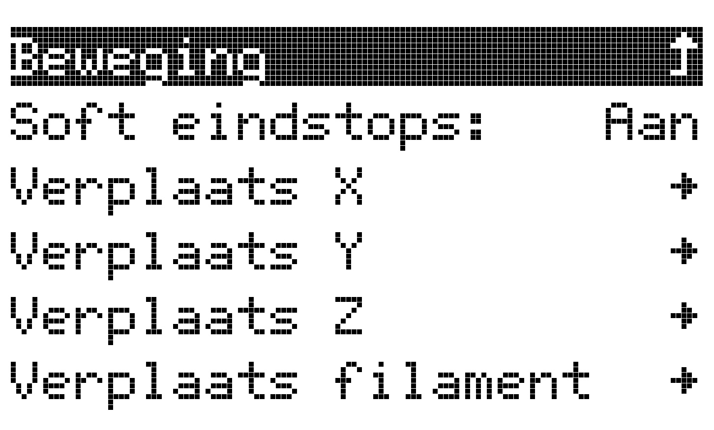
Hier kunnen alle motoren bediend worden. De `Soft eindstops` optie begrenst de maximale bewegingsvrijheid softwarematig. Het is daarom aanbevolen de printer eerst in de thuispositie te brengen voor de beste werking. Bij het instellen van de X0Y0Z0 positie kan het nodig zijn deze optie uit te zetten.

> [!NOTE]  
> De `Verplaats filament` optie zal een waarschuwing geven wanneer de nozzle koud is. Verwarm de nozzle eerst via het `Temperatuur` menu in het hoofdmenu.

## Temperatuur

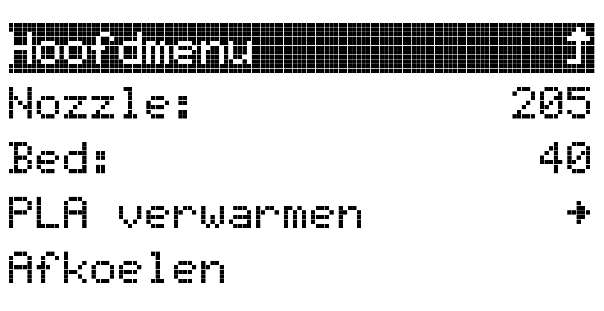

In dit menu kan tijdelijk de temperatuur van de nozzle of het bed ingesteld worden. Het `PLA verwarmen` menu kan gebruikt worden als snelkoppeling voor de juiste temperaturen voor PLA filament. 

> [!NOTE]  
> Wanneer je de verwarming geactiveerd hebt verschijnt de optie `Afkoelen` in het menu. Daarmee schakel je de verwarming weer uit. Je kunt ook gewoon de hele printer even uitschakelen!

> [!CAUTION]
> Schakel de printer niet uit wanneer de extruder nog warm is. De ventilator van de coldend valt dan uit en dat kan verstoppingen veroorzaken.

## Configuratie

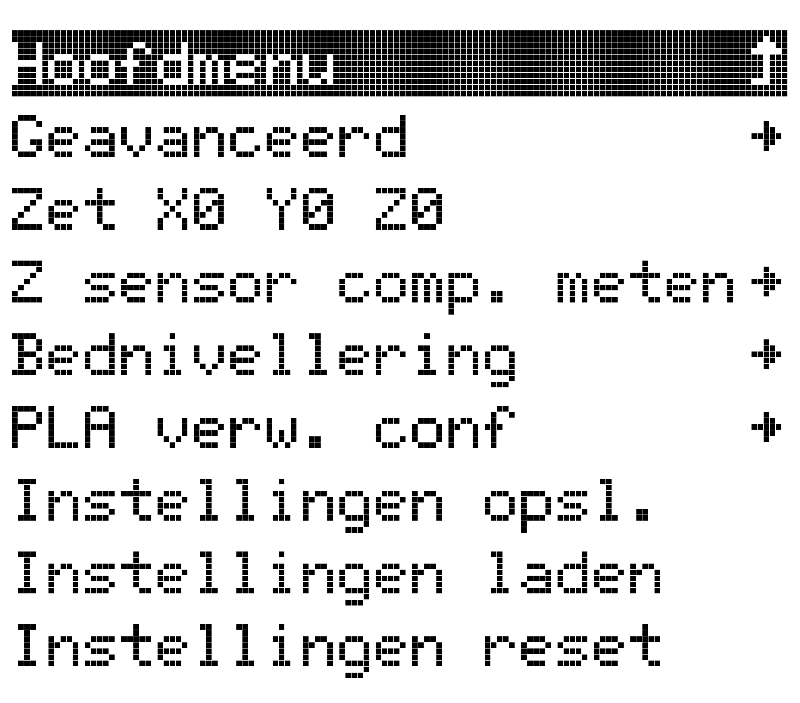

### Zet X0 Y0 Z0

De printer moet weten waar het bed begint. Er is vanaf die beginpositie een ruimte van 18 x 14 cm beschikbaar om op te printen. Mocht dit te weinig zijn, dan kun je zelf de waarden aanpassen in Cura.

Deze optie kan als volgt gebruikt worden:

1. Zet de printer in de thuispositie, via de `Naar thuispositie` optie in het hoofdmenu.
2. Verplaats via het menu `Beweging` -> `As verplaatsen` de X-as naar de linkerrand van de glasplaat, tot 2 cm vanaf de rand.
3. Verplaats de Y-as naar de voorkant van de glasplaat, tot 4 cm vanaf de rand.
4. Verplaats de Z-as nauwkeurig richting het printbed. Eerst met stappen van 1mm, het laatste stukje met 0.1mm. Meet met een papiertje tot je enige weerstand voelt tussen de nozzle en de glasplaat.
5. Activeer nu de optie `Zet X0 Y0 Z0` in het `Configuratie` menu.
6. Sla nu de instellingen op, via `Configuratie` -> `Instellingen opsl.`.

Indien er geen Z-probe aanwezig is moeten de spindels handmatig rechtgezet worden, anders zijn de volgende stappen optioneel.

1. Zet de printer uit (of de motoren in het menu `Beweging`).
2. Beweeg met de hand de printkop naar links 
3. Minimaliseer de afstand van de nozzle tot het bed met een papiertje door aan de linker spindel te draaien.
4. Beweeg de printkop nu naar rechts
5. Controleer de afstand van nozzle tot het bed. Corrigeer met de rechterspindel.
6. Herhaal vanaf 2 om de Z-as zo goed mogelijk in te stellen.

### Z-probe lengte meten

De printer moet weten na hoeveeel millimeter beweging de Z-probe eindstop klikt. Deze optie helpt je de afstand van de nozzle tot het schakelmoment te meten.

Bij het selecteren van deze optie wordt de volgende procedure gevolgd:

1. De printkop gaat automatisch naar de thuispositie.
2. De printkop beweegt naar het midden
3. De printer keert terug naar het statusscherm met de melding `Bevestig Z-probe`
4. Bevestig de Z-probe aan de printkop
5. Druk op de draaiknop
6. De printer wacht nu tot het bed verwarmd is
7. De meting wordt gedaan
8. De printer vraagt nu om de Z-probe te verwijderen, verwijder die
9. Druk op de knop
10. Verplaats nu via het menu de nozzle richting het printbed, meet met een papiertje
11. Wanneer de nozzle het papietje net raakt, kies de optie `Klaar` in het menu
12. De printer weet nu de lengte van de Z-probe. Sla via het `Configuratie` menu de instellingen op.

### Bednivellering

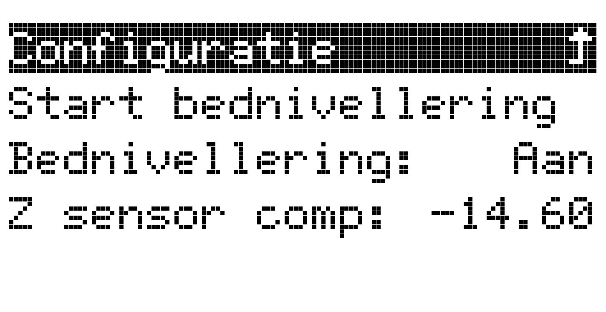

> [!IMPORTANT]  
> Voor deze optie is het belangrijk dat de Z-probe lengte gemeten is. De meetwaarde staat in de `Z-probe len.` in dit menu.

1. Kies `Start bednivellering`
2. De printer zal nu zonder bevesgiging in beeld naar de thuispositie gaan.
3. De printer vraagt om de Z-probe te bevestigen
4. Druk na het bevestigen op de draaiknop
5. Het bed wordt nu verwarmd
6. De printer zal nu 9 punten meten
7. De printer vraagt om de probe te verwijderen, doe dat
8. Sla de instellingen op

> [!NOTE]  
> De bednivellering kan uitgeschakeld worden indien gewenst. Deze optie verschijnt nadat bednivellering al eens gedaan is en de printer naar de thuispositie gebracht is.

### PLA verw. conf.

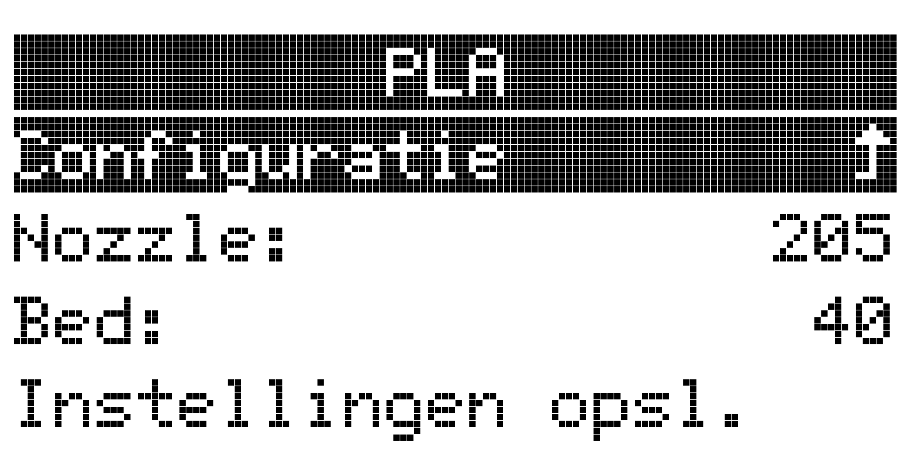

De snelkoppelingen in het menu `Temperatuur` kunnen hier geconfigureerd worden.

### Instellingen opsl., laden, reset

Onderaan het menu staan opties om de instellingen op te slaan. Normaal gesproken verliest de printer alle gedane instellingen wanneer deze uitgezet wordt. Pas bij de `Instellingen opsl` optie worden de instellingen bewaard. Ook de `Instellingen reset` optie zal dus de instellingen resetten maar de bewaarde instellingen nog niet veranderen, daarvoor moeten de geresette instellingen ook nog een keer opgeslagen worden. De `Instellingen laden` zal de laatst opgeslagen instellingen weer inladen. Dat is hetzelfde als de printer uit/aan zetten.

> [!NOTE]  
> Er moet een duidelijke piep komen wanneer je de knop indrukt, anders is er niets opgeslagen.

## Afstellen tijdens het printen

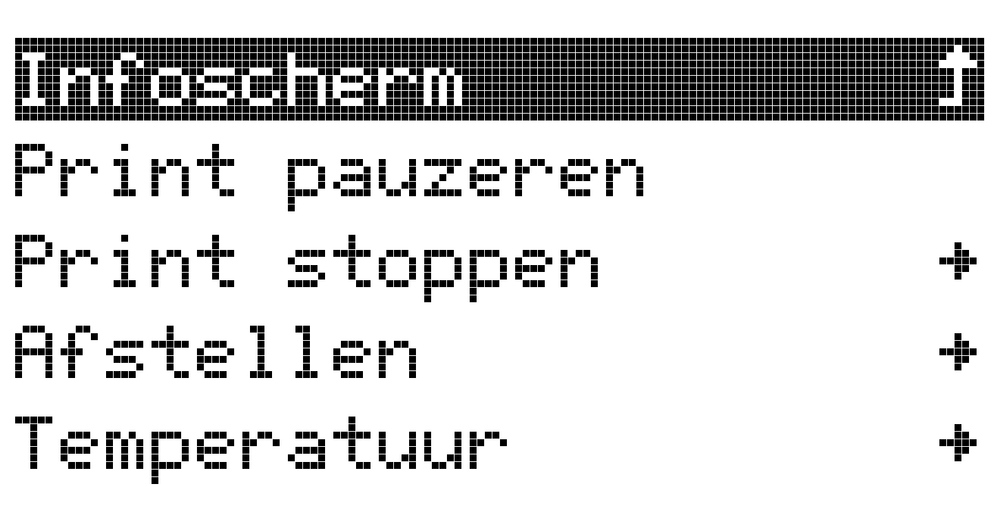

Tijdens het printen heeft het hoofdmenu een extra opties om de print te pauzeren, stoppen en verder af te stellen. In het menu Afstellen staan de volgende opties:

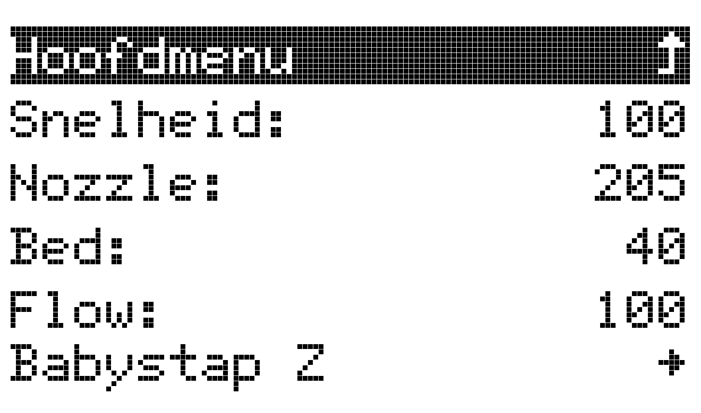

* Snelheid: dit zijn procenten van de basis-instelling. Wanneer je in Cura een printsnelheid 30mm/sec hebt ingesteld, is dat nu 100%. Wil je de snelheid verlagen (vooral bij kleine voorwerpen) dan draai je dit terug naar 80% of 60% of nog minder.
* Nozzle: Je kunt de temperatuur hier aanpassen, maar dat lukt pas nadat de nozzle gestart is met opwarmen.
* Bed: meestal geen andere instelling nodig.
* Flow: de hoeveelheid filament die aangevoerd wordt. Ook dit zijn procenten van de basisinstelling.
* Babystap Z: Wanneer je bij de eerste printlaag denkt dat de printkop toch iets hoger of lager moet staan, kun je dat hier bijstellen. Het is een heel nauwkeurige regeling. Je moet veel draaien om effect te zien.


> [!NOTE]  
> Alle instellingen die je hier aanpast gelden eenmalig
